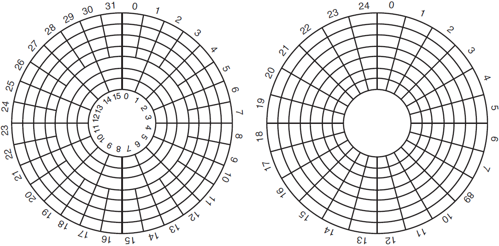
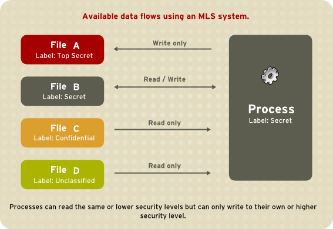
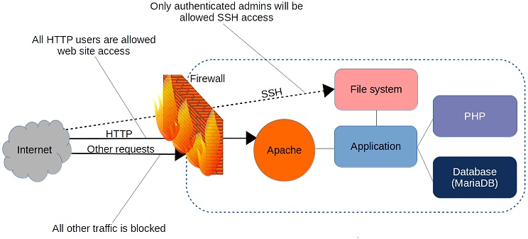
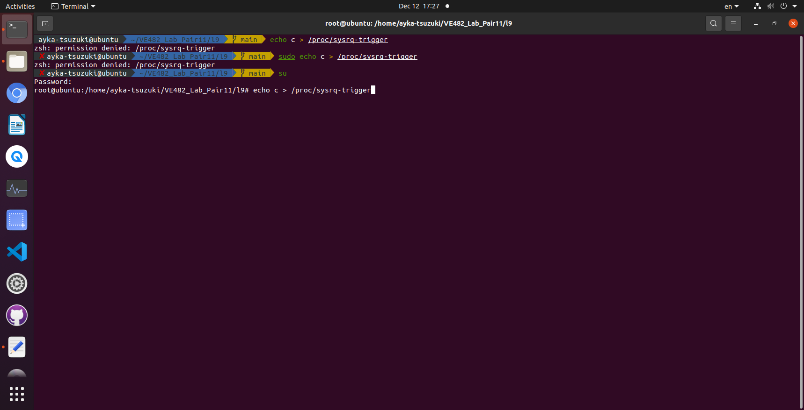

# VE482 Homework 8

Yihua Liu 518021910998

## Ex. 1 — Input/Output

1. Is it possible to scan a document and send it through a wireless network at full speed? Explain why, why not.
   It depends. If the maximal data rate of the scanner device is lower than the maximal data rate of the wireless network device, it is possible; if the maximal data rate of the scanner device is higher than the maximal data rate of the wireless network device, it is not impossible.
   
2. How can an OS facilitate the installation of a new device without any need to recompile the OS or even to reboot it?
   It is an OS design that make devices independent from specific hardware. For UNIX systems, they maintain a table indexed by device numbers and containing pointers to functions for operations like reading and writing with devices, and a new device is installed just by add a table entry for it in general.
   
3. In the slides four I/O software layers are listed; in which layers are the following operations done:
   - Computing the track, sector, and head for a disk read
     Device Drivers
   - Writing command to the device registers
     Device Drivers
   - Checking to see if the user is allowed to use the device
     Device Independent OS Software
   - Converting binary integers to ASCII for printing
     User Level IO Software
   
4. A DMA controller has four channels. The controller is able to request a 32-bit word every 100 nsec. A respond takes equally long. How fast should the bus be in order to avoid being a bottleneck?
   A 32-bit word is 4 bytes large. A bus transaction has one request and one response taking 200 nsec in total.
   $$
   \frac{4\,\text{Bytes}}{2\times10^{-7}\,\text{s}}=2\times10^{7}\,\text{B/s}=20\,\text{MB/s}
   $$
   
5. Briefly explain what a thin client is.
   A thin client is basically just a dumb terminal used by timesharing system. It connects remotely with the server that does most of the work in contrast with fat clients that do most of the work locally and communicate with the server only if data transfer is needed. It has high requirement for network bandwidth but low requirement for local computing hardware, and its performance also depends on the active users on the shared network [^1][^2].

6. Describe how a hard disk is working and give a few details regarding its geometry.
   Hard disk is divided into cylinders, each cylinder divided into tracks, each track divided into hundreds of sectors. Hard disks will not expose information of sector numbers to users, instead, they present a virtual geometry to the operating system. For premier IBM personal computers, the limit of the hard disk is 65535 cylinders, 16 heads, and 63 sectors, so maximal possible size is 31.5 GB. To get over this limit, modern hard disks use LBA (Logical Block Addressing) independent of the geometry specification of a hard disk.
   
   The left is a possible physical geometry of a hard disk and the right is a possible virtual geometry of a hard disk [^1]. The controller does overlapped seeks so that different controllers can read and write on one drive while seeking other drives, and can read or write on multiple drives simultaneously.
   
7. What are differences between RAID 0, 1, 5, 6, and 10?
   RAID 0: writes consecutive strips (data distributed over multiple drives) in round-robin fashion, not real RAID [^1].
   RAID 1: copies (mirrors) all disks, each strip written twice for one write operation.
   RAID 5: strip-to-strip parity written onto all drives uniformly, round-robin fashion.
   RAID 6: similar to RAID 5 but use extra parity blocks, i.e., data across different disks have two parity blocks rather than one.
   RAID 10: no parity, blocks mirrored (copied) and striped [^3].

## Ex. 2 — Multiprocessors

1. Suppose that the `TSL` instruction was not available for synchronizing a multiprocessor. Instead, another instruction, `SWP` was provided that atomically swapped the contents of a register with a word in memory. How could that be used to provide multiprocessor synchronization?
   Preload 1 into the register to be used, swap the register and the memory word, and lock the memory word whose value is 1. The previous value of the memory word is stored in the register. If the memory word is locked before, it will not be changed and wait for caller's loop; if it is not locked before, lock it.
2. Briefly describe virtualization and the main challenges that need to be overcome.
   When we talk about virtualization about operating system, we are generally talking about create a virtual version of hardware resources. Mainly, we do CPU virtualization and memory virtualization. CPU virtualization is to virtualize a physical CPU to multiple virtual CPUs, assigning each virtual CPU to one process. Memory virtualization is to virtualize a physical memory with its corresponding physical addresses to a large virtual memory with its corresponding memory addresses so that processes believe they have a lot of private memory. Challenges for CPU virtualization: processes are the result of CPU virtualization, to schedule processes efficiently and no starving is not easy, especially for real-time operating systems and multi-processor systems. Memory virtualization results in segmentation and paging, to make memory access faster is not easy. It needs to do segmentation with proper granularity and swapping mechanism. To design and adopt different page replacing algorithms and policies is difficult for a wide range of application scenarios. In addition, we have to make sure the virtualization is secure - malicious users cannot corrupt the isolation [^4].
   Another concept of virtualization is virtual machines. We can use virtual machine monitor (VMM) to virtualize one physical hardware to multiple virtual machines. The necessary conditions for virtualization are safety, fidelity, and efficiency. VMM should fully control the virtualized resources. The behavior on virtual machines should be the same as the behavior on real bare machines. Virtual machines need to do CPU virtualization, memory virtualization, and I/O virtualization. The challenge of CPU virtualization is fidelity. For early Intel 386 instructions, sensitive instructions are not a subset of privileged instructions, so that the machine is not able to virtualize. The challenge of memory virtualization is page faults. The solution is to introduce nested page tables or extended page tables to lower the costs. There are four ways to do I/O virtualization: I/O MMU, device domain, and single root I/O virtualization (SR-IOV).

## Ex. 3 — File systems

1. Assuming the current working directory is `/usr/share/doc/mutt/examples` what is the absolute path of `../../../doc/../../lib/mutt`?
   `/usr/lib/mutt`
2. A Unix system has 1KiB blocks and 4B disk addresses. What is the maximum file size if i-nodes contain 13 direct entries, and one single, double, and triple indirect entry each?
   Direct entries: $13*1=13$ addresses
   Single indirect entry: $1*1024/4=256$ addresses
   Double indirect entry: $1*256*256=256^2$ addresses
   Triple indirect entry: $1*256*256*256=256^3$ addresses
   The maximum file size is $(13+256+256^2+256^3)*1024\approx16.84\,\text{GB}\approx16.06\,\text{GiB}$.
3. The time required to read a certain number of bytes can be approximated by summing the seek, rotation delay, and transfer times. Given a disk with mean seek time of 8 msec, a rotation rate of 15,000 rpm and 262,144 bytes per track what are the data rates for block sizes of (i) 1 KB, (ii) 2 KB, and (iii) 4 KB?
   Rotation rate = 15000 rpm / 60 = 250 r/s.
   (i) Data rate = 262144 * 250 = 65536000 B/s
   (ii) Data rate = 262144 * 250 = 65536000 B/s
   (iii) Data rate = 262144 * 250 = 65536000 B/s
   According to [Disk sector - Wikipedia](https://en.wikipedia.org/wiki/Disk_sector), sector means the physical disk area while block is an abstraction of physical data storage possibly multiple sectors, so it is not related to any disk calculation including data rates. Besides, data rate is not relate to the mean seek time.

## Ex. 4 — Security

1. If using only lowercase letters how many possible 8 letter words can be chosen? Explain why a password should always contain lower and uppercase letters, numbers and symbols.
   If using only lowercase letters, $26^8=208827064576$ letter words can be chosen. If a hacker can try 1000000 words per second, the password will be hacked after only 58 hours. However, if using lower and uppercase letters and numbers, $62^8=218340105584896$ letter words can be chosen. Still if a hacker can try 1000000 words per second, the password will be hacked after 2527 days. This number will grow even larger if using additional symbols. Thus, a password should always contain lower and uppercase letters, numbers and symbols.
2. Explain why memory dynamically allocated using `malloc` is sometimes random and some other times set to 0.
   If the pages of allocated memory are replaced from disk, they are set to 0, but if they are other parts of memory previously used, the allocated memory is random.
3. A computer system is made of several components each featuring a different level of security. How secure is this system?
   If the system is well-designed, it can be a secure design known as MLS (Multilevel Security). For example, SELinux (Security-Enhanced Linux) uses the Bell-La Padula Model (BLP):
   
   It uses Type Enforcement (TE) for integrity, ensuring a subject has an appropriate clearance to access an object of a particular classification. Compared with common security mechanism, it needs more work to carefully isolate different information security levels like Top Secret, Secret, Confidential, and Unclassified [^5].
4. Can security be achieved? Explain your answer.
   Security can never be completely achieved, what is pursued is a tradeoff between security and other features like convenience for different application scenarios. For example, the fingerprint sensors installed on most new mobile phones can be cracked by experts, but they are still popular because such level of security is enough. Complete security cannot be achieved also because as a system grows too complex, it is impossible to find out all flaws in limited time with limited resources.

## Ex. 5 — Research

Write about a page on the topic of firewalls on Linux systems; include information on `iptables`, `ebtables`, and `arptables`. Do not forget to reference your sources of information.

A firewall is basically a set of rules and can filter requests based on protocol or target-based rules.



`iptables` is an administration tool to manage firewall rules [^6] and IPv4/IPv6 packet filtering and NAT. More specifically, `iptables` is a user-space utility program that allows system administrators to configure IP packet filter rules of the Linux kernel firewall [^7]. It can set up, maintain, and inspect the tables of IPv4 and IPv6 packet filter rules in the Linux kernel, and tables contain built-in chains and user-defined chains. Chains are lists of rules that can match a set of packets, and each rule specifies "what to do with a packet that matches", or called targets [^8].

`ebtables` is a tool for Ethernet bridge frame table administration. It can also set up and maintain the tables of rules inside the Linux kernel to inspect Ethernet frames. It is analogous to the `iptables` but less complicated because the Ethernet protocol is simpler than the IP protocol. For `ebtables`, there are three tables with built-in chains, and each chain is an ordered list of "rules that can match Ethernet frames" [^9]. A processing specification tells what to do with the matching frame.

`arptables` is a network administrator's tool for maintaining the Address Resolution Protocol (ARP) packet filter rules. The tools may be used to "create, update, and view the tables that contain the filtering rules", similarly to `iptables` [^10]. Tables and chains are similar to `iptables`. Take the following script as an example, `aaaa` is the address for the use of machine `cccc` and no other machines allowed to connect to it [^11].

```bash
# Configure iptables to NAT any attempt to use aaaa on
# outgoing packets to machines other than cccc to use
# bbbb instead
iptables -t nat -A POSTROUTING -s aaaa ! -d cccc \
    -j SNAT --to bbbb

# Ignore arp requests from machines other than cccc for
# address aaaa.
arptables -A IN ! -s cccc -d aaaa -j DROP

# Mangle any outgoing requests from address aaaa to any
# machine but cccc to use address bbbb instead.
arptables -A OUT -s aaaa ! -d cccc -j mangle \
    --mangle-ip-s bbbb
```

The Linux firewall included by Linux distribution is called `netfilter`. There are other tools like `UFW` or `Firewall Builder` that can configure Linux firewall.

## Ex. 6 — Linux

What is a kernel panic? Generate one on your Linux system and troubleshoot it. Provide all the details.

Kernel panic is a safety measure taken by an operating system's kernel when internal fault errors are deteted and to continue running the system has a high risk of significant data loss or safely recovery may not be done [^12]. Generate one [^13]:

```bash
echo c > /proc/sysrq-trigger
```



## Ex. 7 — Course survey

Complete the course evaluation survey and get a +5 bonus on the homework.


## References

[^1]: Tanenbaum, Andrew S., and Herbert Bos. *Modern Operating Systems.* 4th ed. New Jersey: Pearson Education, 2015.
[^2]:Wikipedia contributors. "Thin client." *Wikipedia, The Free Encyclopedia*. Wikipedia, The Free Encyclopedia, 10 Oct. 2021. Web. 12 Dec. 2021.
[^3]: Natarajan, Ramesh. "RAID 0, RAID 1, RAID 5, RAID 10 Explained with Diagrams." *The Geek Stuff*, The Geek Stuff, 10 Aug. 2010. Web. 12 Dec. 2021.
[^4]: Arpaci-Dusseau, Remzi H., and Andrea C. Arpaci-Dusseau. *Operaing Systems Three Easy Pieces*. Arpaci-Dusseau Books, 2018. Web.
[^5]: [43.6. Multi-Level Security (MLS) (mit.edu)](https://web.mit.edu/rhel-doc/5/RHEL-5-manual/Deployment_Guide-en-US/sec-mls-ov.html)
[^6]: Clinton, David. "Linux firewalls: What you need to know about iptables and firewalld." *opensource.com*, opensource.com, 18 Sep. 2021. Web. 12 Dec. 2021.
[^7]: Wikipedia contributors. "Iptables." *Wikipedia, The Free Encyclopedia*. Wikipedia, The Free Encyclopedia, 8 Sep. 2021. Web. 12 Dec. 2021.
[^8]: Eychenne, Herve. "iptables/ip6tables — administration tool for IPv4/IPv6 packet filtering and NAT." Linux Manual page.
[^9]: Netfilter contributors. "ebtables - Ethernet bridge frame table administration (nft-based)." Linux Manual page. 2011.
[^10]: Wikipedia contributors. "Arptables." *Wikipedia, The Free Encyclopedia*. Wikipedia, The Free Encyclopedia, 12 Jun. 2020. Web. 12 Dec. 2021.
[^11]: Fenlason, Jay. "arptables - administration tool for arp packet filtering." Linux Manual page.
[^12]: Wikipedia contributors. "Kernel panic." *Wikipedia, The Free Encyclopedia*. Wikipedia, The Free Encyclopedia, 11 Nov. 2021. Web. 12 Dec. 2021.
[^13]: Huynh, Phuoctai. "USE /PROC/SYSRQ-TRIGGER IN LINUX." *phuoctaihuynh.wordpress.com*, phuoctaihuynh.wordpress.com, Dec 5, 2019. Web.